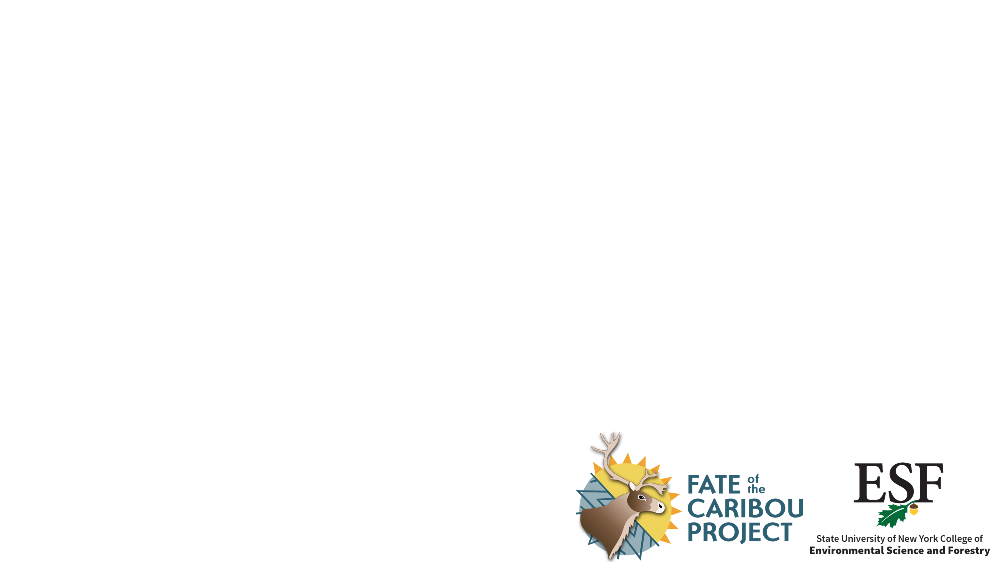
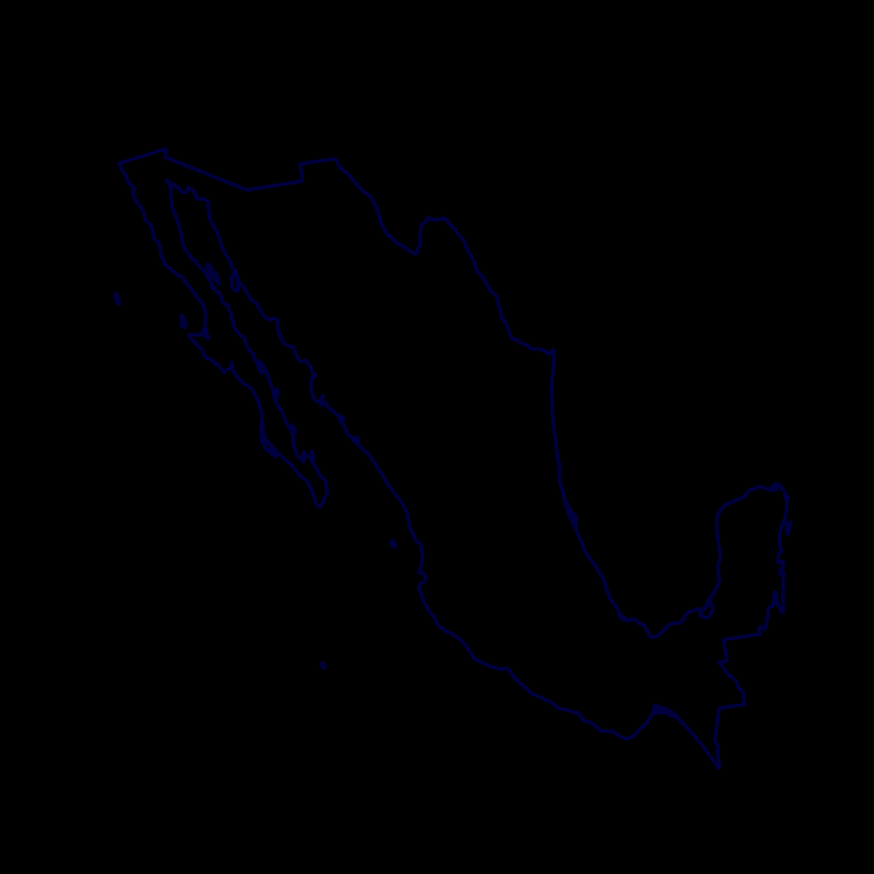

```{r, echo=FALSE, eval = TRUE}
htmltools::img(src = "assets/ESFStacked_Full color.png", alt = 'banner', 
               style = 'position:absolute; top:0; right:0; padding:10px; width:150px')
```

# TuktuTools Tutorials

- [Intro slides](lectures/TuktuToolsTutorials/TuktuWelcome.html)
- [Part I: Basics](lectures/TuktuToolsTutorials/TuktuTools_PartI.html)
- [Part II: Summaries](lectures/TuktuToolsTutorials/TuktuTools_PartII.html)
- [Part III: Estimating Parturition](lectures/TuktuToolsTutorials/estimating_parturition.html)
- [Part IV: Obtaining weather covariates](lectures/TuktuToolsTutorials/little_weatherStation_code.html)


# Bayesian MCMC with STAN

Guest lecture for **EFB 796: WinBUGs for Population Ecologists** with [Dr. Jonathan Cohen](https://www.esf.edu/faculty/cohen/)

- Slides: [**Background on Bayesian MCMC**](lectures/Lecture_BayesianMCMC/BayesianMCMC_test.Rmd)

- Lab: [**Lilac phenology analysis with STAN**](lectures/Lab_MCMCwithSTAN/BayesianLilacs.html)

- Data:  [**Lilac Locations**](lectures/Lab_MCMCwithSTAN/data/LilacLocations.csv) | [**Lilac Phenology**](lectures/Lab_MCMCwithSTAN/data/LilacPhenology.csv)

- [**STAN model scripts**](lectures/Lab_MCMCwithSTAN/stanmodels/). 


***Frequentists and Bayesians going at it.***


# How to Build an Rpackage

Guest lecture for **EFB 796:  R and Reproducible Research** with [Dr. Hyatt Green](https://www.esf.edu/faculty/green/)

- Slides: [**How and Why to Build an R package**](lectures/Lecture_HowToBuildRPackages/HowToRPackage.html)
- [**`competitoR` package bundle**](lectures/Lecture_HowToBuildRPackages/competitoR.zip)


#  Measurements and consequences of (im)-permeability

  - [North American Caribou Workshop - Anchorage 2023](lectures/NACW_2023/Permeability_Presentation.html)
  - [Global Initiative on Ungulate Migration - Grand Teton N.P. 2023](lectures/NACW_2023/GIUM_permeability.html)




# Matrices in Ecology

Lecture from **EFB 796: Practical Seminar in Quantitative Wildlife Ecology** on the [Mathemagics of Matrices](lectures/MatricesInEcology/matrices.html)




```{r, echo = FALSE, eval = FALSE}
# renderthis::to_pdf("file.rmd")
```

<!-- 
instructions:
git push origin gh-pages

Or, to merge with (non-existent) main:
1. git checkout gh-pages
2. git merge main
3. git checkout main
--> 
