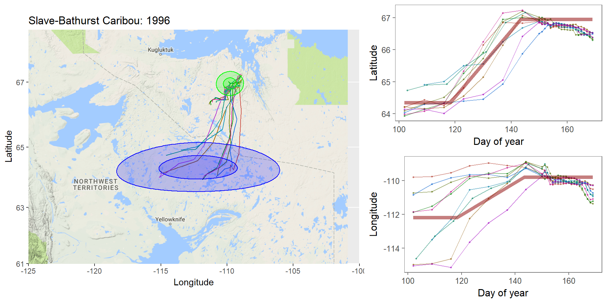

```{r setup, include=FALSE}
knitr::opts_chunk$set(echo = FALSE, message = FALSE, cache = FALSE, 
                      warning = FALSE, las = 1, dpi = 100)
#output: html_document
```

```{r colsFunction, eval = FALSE}
xaringan::inf_mr()
```

.pull-left[
## What is Frequentist? 

In frequentist inference, observations are random while parameters are fixed, unknown quantities.  

**Probabilities** are interpreted as the expected **frequency** of many-many-many observations of a random process. 

> Has this ever troubled you?  The idea that there is a "TRUE", say, regression coefficient on the interaction between salinity and temperature in predicting the presence of a fish?
]

--

.pull-right[

## What is Bayesian?

In the Bayesian approach **probability** are baldly interpreted as a **subjective measure of belief**.   

> Yikes!  But also, to many, appealing. 

EVERYTHING - the response variables and the parameters and hypotheses are all RANDOM VARIABLES. We use data to determine the certainty (**Credibility**) of an estimate. 

> That **salinity** X **temperature** interaction reflects not something absolute, but something (intrinsically sloppy that) we have *learned* about *Solea solea*. 

]


---


## Philosophical Goals

.pull-left[

**Frequentist**

Guarantee correct probabilities of error taking into account the sampling, the sample sizes, the models. 

- MINUS: Requires convoluted interpretation of confidence intervals, Type I and Type II errors

- PLUS: More intrinsically ``objective'' and logically consistent.
]

.pull-right[

**Bayesian**

Analyze the extent to which more information improves our beliefs about a system. 

- MINUS: It's all about beliefs! ... with major consequences.

- PLUS: More intuitive interpretation and implementation, e.g. *this is the probability of this hypothesis, and here is the probability that this parameter is equal to this value*.  Probably closer to how humans naturally interpret the world.  
]

---
.large[


## Practically: Why Bayesian?

Complex models with limited data, e.g. *Hierarchical models*, where 
.Large[

$$Y \sim Dist(\theta);\,\,\,\,\,\theta \sim Dist(\gamma);\,\,\,\,\,\gamma \sim Dist (\nu)$$

]

Actual prior knowledge (surprisingly rare)

]

---

## Example: Caribou spring migrations

.pull-left-80[]

.pull-right-20[
**Challenges:**  Lots and lots of animals | Non-independent | High level of individual variability | High level of sampling variability | Unit of interest is NOT individual, it’s "Herd-Year"
]

---

## Example: Caribou spring migrations


---

## Example: Caribou spring migrations - comparing across years




---

## Example: Caribou spring migrations - comparing across years


---

## Example: Caribou spring migrations - comparing across years


---

## Bayes Rule (redacted):

$$\large{\pi(\theta | {\bf X}) \propto p({\bf X} | \theta) \pi (\theta)}$$

.pull-left[
Some typical Bayes shorthand:

- $\pi()$ and $p()$ represent **probability functions** (mass or density)
- $\pi(\theta)$ is the **prior** distribution of our "ideas" about $\theta$
- $\pi(\theta|{\bf X})$ is the **posterior** distribution of our "ideas" about $\theta$, given the information provided by the data. 
- $p(X | \theta)$ is the probability of the data given parameter values ... i.e. the **Likelihood Function**
]

.pull-right[
Note immediately: 

- This is not an *equality* - but no matter because it is a distribution that can be normalized. The missing demonimator is $p({\bf X})$ (a very difficult thing to compute).
- From a frequentist perspective, it is ABSURD to talk about the $\pi(\theta)$ - since that is assumed to be fixed. 
- The biggest bugaboo of Bayes is in determining the **prior** distribution.  What should the prior be?  What influence does it have?
]

---

## The Goal:

to compute the posterior distribution of the parameters: .red[$$\huge \pi(\theta | {\bf X})$$]

A **point estimate** is the mean (or median or mode) of the posterior: $$\widehat{\theta}  = E(\theta | {\bf X}) = \int \theta \pi(\theta|{\bf X})\, d\theta.$$

A **credible interval** is $a$ and $b$ such that: $$\int_a^b \pi(\theta|{\bf X}) = 1 - \alpha$$

You are allowed to interpret this as .blue[the probability of a parameter being within this interval]! 

(to the great relief of undergraduate stats students who - like any normal humans - always misinterpret frequentist .green[Confidence Intervals]). 


---
## Computation

.pull-left-30[


Pierre-Simon Laplace (1749-1827) 

(see: Sharon Bertsch McGrayne: *The Theory That Would Not Die*)
]


Some problems are **analytically tractable**, e.g. the Binomal likelihood- Beta prior.  
- These cases are rare and rely on nice conjugate pairs and mainly pop-up on graduate level statistics theory exams.

--

If you have a few parameters, and odd distributions, you might be able to **numerically** multiply / integrate the prior and likelihood (aka **grid approximation**).
- But if you have a lot of parameters, this is a near impossible operation to perform!

--


Though the theory dates to the 1700's, and even its interpretation for inference dates to the early 1800's (see Laplace), it has been difficult to implement more broadly ... until the development of **Markov Chain Monte Carlo** techniques.  


---

## Markov Chain Monte Carlo (MCMC)

.pull-left[

The idea of MCMC is to "sample" from parameter values $\theta_i$ in such a way that the resulting distribution approximates the posterior distribution.  

Recall that **Markov Chain** is a random process that depends only on its previous state, and that (if *ergodic*), leads to a **stationary distribution**. 

The "trick" is to find sampling rules (**MCMC algorithms**) that asymptotically approach the correct distribution.  
]

--
.pull-right[

There are several such (related) algorithms:

- Metropolis-Hastings
- Gibbs Sampling
- No U-Turn Sampling (NUTS)
- Reversible Jump

A large, evolving literature and body of work!
]

---

## Metropolis-Hastings Algorithm

1. Start somewhere:  $\theta_0$, and compute $p_0 = \pi(\theta_0 | {\bf X})$
2. Make a jump to a new candidate location: $\theta_1^* = \theta_0 + J_1$, where the Jumps are some random step (e.g. normal)
3. Compute the posterior: $p_1 = \pi(\theta_0 | {\bf X})$
4. IF $p_1 > p_0$ - Accept $\theta_1^*$
5. IF $p_1 < p_0$ - Accept $\theta_1^*$ with probability $p_1 / p_0$
6. Go to step 2

---

## Metropolis-Hastings: Coin Example 
.pull-left[

You've flipped 5 heads (H,H,H,H,H).  Your initial "guess" for $\theta$ is Uniform(0,1). How do these data shift your prior?

MCMC: 
.small[
```{r, echo = TRUE}
prior <- function(theta) dunif(theta)
likelihood <- function(theta) 
  ifelse(theta >= 0 & theta <=1, theta^5, 0)
theta <- 0.3
n <- 1000
p.old <- prior(theta)*likelihood(theta)
thetas <- theta
while(length(thetas) <= n){
  theta.new <- theta + rnorm(1,0,0.05)
  p.new <- prior(theta.new)*likelihood(theta.new)
  if(p.new > p.old | runif(1) < p.new/p.old){
    theta <- theta.new
    thetas <- c(thetas,theta)
    p.old <- p.new
  }
}
```
]]

.pull-right[

Plot:
```{r, eval=FALSE, echo = TRUE}
plot(thetas, type="o", pch=21, bg="darkgrey")
hist(thetas[-(1:100)], freq=FALSE, col="grey", bor="darkgrey")
curve(6*x^5, add=TRUE, col=2, lwd=3)
```


```{r, fig.height = 4, echo = FALSE, eval = TRUE}
par(mfrow=c(2,1), bty="l", mar = c(3,3,1,1))
plot(thetas, pch=19, col=rgb(0,0,0,.1), type="o", xlab="")
hist(thetas[-(1:200)], freq=FALSE, col="grey", bor="darkgrey", breaks=40, main="posterior")
curve(6*x^5, add=TRUE, col=2, lwd=3)
```
]

---

# Metropolis-Hastings


.pull-left-70[]

Metropolis-Hastings is great, simple, and general.  

BUT ... sensitive to step size.  

AND ... can be too slow, because it ends up rejecting a great many (most) steps. 


---


.pull-left[
## Gibbs sampling


]

.pull-right[
<br><br>

In Gibbs sampling, rather than accept/reject with appropriate probabilities, you march around a parameter space with the appropriate conditional probabilities:
$$\theta_{1,i+1} \sim p(\theta_{1,i} |X, \theta_{2,i})$$ and draw a step from THAT distribution. 

Then you fix the new $\theta_1$ and draw the next $\theta_2$ from the distribution conditioned on $\theta_2$: $$\theta_{2,i+1} \sim p(\theta_{2,i} | X, \theta_{1,i})$$

Much faster (and therefore more common) than Metropolis-Hastings.  Note the far higher effective sample size!

**BUGS** (OpenBUGS, WinBUGS) is  Bayesian inference Using Gibbs Sampling

**JAGS** is "just another Gibbs sampler"
]

---


## Other Samplers


.pull-left-40[
**Hamiltonian Monte Carlo (HMC)** - is a Metropolis-Hastings that climbs gradients and is therefore faster and better with correlation between parameters. 

**No-U Turn Sampler (NUTS)** - stops the MCMC when it is curling up on itself too much - which speeds things even more by not requiring a fixed length. 

This is what STAN uses (see http://arxiv.org/pdf/1111.4246v1.pdf).
]


.pull-right-60[


*(Hoffman and Gelman 2011)*

]

---

## STAN

.pull-left-30[


Stanislaw Ulam (1909-1984) holding a mechanical Monte Carlo simulator of neutrino diffusion.
]

.pull-right-60[
To fit a model using STAN, the steps are:

 1. generate a STAN syntax pseudo-code for the model (same in JAGS and BUGS) 
 2. run an R command that compiles the model in C++
 3. use the generated function to fit your data
 
]


---

### STAN example - Linear Regression

STAN code is a sort of hybrid between R (e.g. with handy distribution functions) and C++ (i.e. you have to declare your variables).  Each model definition comes with **three blocks**:


.pull-left[
*1*. The **data block**:

.footnotesize[
```
data {
  int<lower=0> n; //
  vector[n] y; // Y Vector
  vector[n] x; // X Vector
}
```
]

The raw data.  Here: `y` and `x`, both of which are (numeric) vectors of length `n`, an integer > 0.

*2*. The **parameter block**
.footnotesize[
```
parameters{
  real beta0;  // intercept
  real beta1;  // slope
  real<lower=0> sigma; // residual variance
}
```
]

The parameters you are estimating: intercept, slope and variance. 
]

.pull-right[
*3*. The **model block**

.footnotesize[
```
model{
   vector[n] yhat;  // useful to define
  // Priors
    sigma ~ inv_gamma(0.001, 0.001); 
    beta0 ~ normal(0,1e3);
    beta1 ~ normal(0,1e3);
  // Likelihood
    yhat = beta0 + beta1 * (x - mean(x));
    y ~ normal(yhat, sigma); 
}
```
]
Note: lots of semicolons; you CAN vectorize; many distributions (and functions like `mean`) are available

**Main Tip:** Refer frequently to the manual: https://mc-stan.org/docs/stan-users-guide/index.html! 
]

---

## Step 2. Compile the model in R

You save your model in a separate file (I called it `lm.stan` ... note: Rstudio provides STAN syntax coloring!)  And then compile the model with the `stan_model()` command. 

```{r, eval=FALSE, echo = TRUE}
require(rstan)
lm_stan <- stan_model(file = "lm.stan")
```

```{r, cache=TRUE, echo=FALSE, eval=FALSE}
save(lm_stan, file="stanmodels/lm_stan_lecture.stanmodel")
```

This command is taking the model you described and encoding and compiling a NUTS sampler in C++.  That's wonderful!  Believe me it is a great, great pain (wihtout lots of experience) to write that C++ code yourself, and it is guaranteed to be way faster than the equivalent in R.  Now you have your own Bayesian MCMC model in your workspace. 

**Note: this step can be quite slow!**

---


.pull-left[
## 3. Run the model in R

The key function here is `sampling()`.  Note, also, that to give the data to your model, it has to be in the form of a list.  

Simulating some data: 

```{r, echo=-1, message=FALSE, warning=FALSE}
require(rstan); load("stanmodels/lm_stan_lecture.stanmodel")
beta0 <- 4
beta1 <- -.5
sigma <- 2

X <- runif(100,0,20)
Y <- rnorm(100, beta0+beta1*X, sigma)
Data <- list(n = length(X), y=Y, x=X)
```


Perform the sampling!
.large[
```{r, message=FALSE, echo=1, eval=FALSE}
lm_stan.fit <- sampling(lm_stan, Data)
# save(lm_stan.fit, file = "lm_stan.fit")
```
]]

--

.pull-right[

.red.scriptsize[
```
SAMPLING FOR MODEL 'lm' NOW (CHAIN 1).
Chain 1: 
Chain 1: Gradient evaluation took 2.2e-05 seconds
Chain 1: 1000 transitions using 10 leapfrog steps per transition would take 0.22 seconds.
Chain 1: Adjust your expectations accordingly!
Chain 1: 
Chain 1: 
Chain 1: Iteration:    1 / 2000 [  0%]  (Warmup)
Chain 1: Iteration:  200 / 2000 [ 10%]  (Warmup)
Chain 1: Iteration:  400 / 2000 [ 20%]  (Warmup)
Chain 1: Iteration:  600 / 2000 [ 30%]  (Warmup)
Chain 1: Iteration:  800 / 2000 [ 40%]  (Warmup)
Chain 1: Iteration: 1000 / 2000 [ 50%]  (Warmup)
Chain 1: Iteration: 1001 / 2000 [ 50%]  (Sampling)
Chain 1: Iteration: 1200 / 2000 [ 60%]  (Sampling)
Chain 1: Iteration: 1400 / 2000 [ 70%]  (Sampling)
Chain 1: Iteration: 1600 / 2000 [ 80%]  (Sampling)
Chain 1: Iteration: 1800 / 2000 [ 90%]  (Sampling)
Chain 1: Iteration: 2000 / 2000 [100%]  (Sampling)
Chain 1: 
Chain 1:  Elapsed Time: 0.074589 seconds (Warm-up)
Chain 1:                0.08623 seconds (Sampling)
Chain 1:                0.160819 seconds (Total)
Chain 1: 
... etc ....
```
]

Note: **Lightning quick!**  (can also easily / naturally use multiple cores) 

]

---

## MCMC diagnostics


Output of STAN fit:

.scriptsize[
.pull-left-70[
```{r, echo = 2}
load(file = "lm_stan.fit")
lm_stan.fit
```
]]

.pull-right-30[
```{r, echo = TRUE, fig.height = 3, fig.width = 2.5}
plot(lm_stan.fit)
```
]


---

# More interesting MCMC's ...


.pull-left-60.large[
in lab!

- change point - fitting lilac data
]

.pull-right-40[


]

---

Pierre-Simon Laplace (1749-1827)
====================================

.pull-left-30[


.center[*Essai Philosophique sur les Probabilités* - 1814]
]

.pull-right-70[

> .blue[La théorie des probabilités n'est au fond, que le bon sens réduit au calcul ...  Par là, elle devient le supplément le plus heureux à l'ignorance et à la faiblesse de l'esprit humain... [I]l n'est point de science plus digne de nos méditations, et qu'il soit plus utile de faire entrer dans le système de l'instruction publique.]

--- 

> .green[The theory of probabilities is no more than common sense reduced to calculation... It is therefore the most happy supplement to the ignorance and weakness of the human spirit. There is no science more worthy of our meditations, or more useful to include in our system of public instruction.]
]


