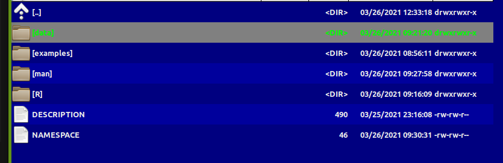
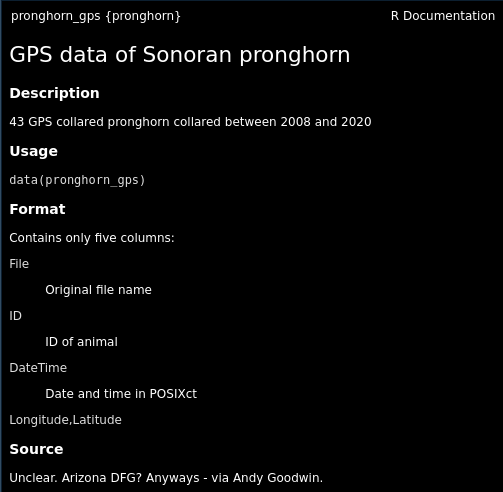

```{r setup, include=FALSE}
knitr::opts_chunk$set(echo = TRUE, cache = FALSE, message = FALSE, warning = FALSE)
```
```{r echo = FALSE}
require(elieslides)
```


## Why!?

<div style="float:left; width: 50%;">

- Conquer and permanently tame confusing folder soups of data and R scripts
- Make code **ultra-compact**, **well-documented**, **highly replicable**
- Dramatically shorten time to get back on track 

ultimately: 

- (truly) publish tools and methods

</div>

<div style="float:right; width: 50%;">


</div>


## Processing before:

(this is a small snippet of a data processing nightmare)

```{r, eval = FALSE}
gps.dir <- "data/SonoranPronghorn/Locations_GPSCollarTelemetry/"
pronghorn <- read.csv(paste0(gps.dir,f.v1[i])) %>% processRaw_v1(id = id.v1[i], filename = f.v1[i])
pronghorn.sf <- st_as_sf(df.raw, coords = c("ECEF_X..m.","ECEF_Y..m.","ECEF_Z..m.")) %>% st_set_crs(4978) %>% 
      st_transform(4326) %>% st_coordinates
    
    with(df.raw, 
         data.frame(
           File = filename, 
           ID = CollarID,
           DateTime = mdy_hms(paste(UTC_Date, UTC_Time)),
           Latitude = ll[,"Y"], 
           Longitude = ll[,"X"],
           Elevation = ll[,"Z"])) %>% 
      subset(!is.na(DateTime))
```


## Processing now

```{r, eval = FALSE}
require(pronghorn)
data("pronghorn_gps")
str(pronghorn_gps)
```
```{r, echo = FALSE}
require(pronghorn)
data("pronghorn_gps")
str(pronghorn_gps[,-1])
```


</div>

## R package structure





- `R` folder contains code
- `data` folder contains data - as `.rda`
- `man` folder contains documentation 
- `DESCRIPTION` - file contains essential info
- `NAMESPACE` - complicated file (*mainly automated*)

<div class='left' style='float:left;width:48%'>
</div>
<div class='right' style='float:right;width:48%'>
</div>


## `DESCRIPTION` file

```
Package: pronghorn
Type: Package
Title: Sonoran pronghorn analysis project
Version: 0.1.0
Author: Elie, Nicky, others
Maintainer: The package maintainer <yourself@somewhere.net>
Description: The pronghorn package is a PRIVATE collaborative package containing processed data, 
             code and results for analysis of Sonoran pronghorn.
License: PRIVATE
Encoding: UTF-8
LazyData: false
Depends: lubridate, magrittr, plyr, dplyr, ggplot2, ggpubr, sp, sf, stringr
Suggests: mapview 
RoxygenNote: 7.1.1
```

## Documentation

<div class='left' style='float:left;width:35%'>

R help  document


</div>


<div class='right' style='float:right;width:60%'>

R man file
```
% Generated by roxygen2: do not edit by hand
% Please edit documentation in R/datadocumentation.R
\docType{data}
\name{pronghorn_gps}
\alias{pronghorn_gps}
\title{GPS data of Sonoran pronghorn}
\format{
Contains only five columns:
\describe{
  \item{File}{Original file name}
  \item{ID}{ID of animal}
  \item{DateTime}{Date and time in POSIXct}
  \item{Longitude,Latitude}{}
}
}
\source{
Unclear.  Arizona DFG?  Anyways - via Andy Goodwin.
}
\usage{
data(pronghorn_gps)
}
\description{
43 GPS collared pronghorn collared between 2008 and 2020
}
```

</div> 

## Using Roxygen

Streamlines documentation by turning "comments" into help files. 
Need to install `roxygen2` package and fiddle with some "build" settings.

```
#' GPS data of Sonoran pronghorn
#'
#' 43 GPS collared pronghorn collared between 2008 and 2020
#' 
#' @usage
#' data(pronghorn_gps)
#'
#' @format Contains only five columns:
#' \describe{
#'   \item{File}{Original file name}
#'   \item{ID}{ID of animal}
#'   \item{DateTime}{Date and time in POSIXct}
#'   \item{Longitude,Latitude}{}
#' }
#' @example
#' examples/pronghorn_gps_examples.R
#' @source Unclear.  Arizona DFG?  Anyways - via Andy Goodwin. 
#' @keywords data
```


</div>


## How to create a package

1. By hand

2. `base::package.skeleton()`

3. `usethis::create_package()`

4. build directly off of existing GitHub project


##  Building an R package

<div style="float:left; width: 40%;">
We're going to take some of the scripts provided in `fittingfunctions.R` and the datasets `single.csv` and `mixture.csv` and systematically build a package called `competitor` (or any other name you choose).  

It's not too important what the package actually does, but basically it allows you to fit a logistic model and experiment with a competition model of two species of paramecium from a famous 1930's experiment by Giorgi Gause. 
</div>


<div style="float:right; width: 60%;">

```{r, echo = FALSE, out.width = "100%"}
source("content/fittingfunctions.R")
single <- read.csv("content/single.csv")
mixture <- read.csv("content/mixture.csv")
pars()
plot(aurelia~Day, data = single, col = 1, type = "o")
lines(caudatum~Day, data = single, col = 2, type = "o")
legend("bottomright", legend = c("aurelia", "caudatum"), col = 1:2, pch = 1, lty = 1)

fit1 <- fitLogistic(single, y = "aurelia", time = "Day", 1, 200, .75)
fit2 <- fitLogistic(single, y = "caudatum", time = "Day", 1, 200, .75)

linesLogistic(fit1, lwd = 3)
linesLogistic(fit2, col = 2, lwd = 3)
```


## Step I. Build a skeleton (empty) package

<div style="float:left; width: 45%;">

First, know your working directory!  And where you'd like your package to reside. 

```{r}
getwd()
```

Also - if you're on a Windows machine and you haven't done so already, you will need to install the `Rtools` bundle of compilation tools.  The easiest way to do that is with:

```{r eval = FALSE}
installR::install.Rtools()
```

You're ready to build your package skeleton: 

```{r, eval = FALSE}
require(usethis)
create_package("combinator")
```
</div>


<div style="float:right; width: 55%;">

You'll see output that looks like this:

```
Package: combinator
Title: What the Package Does (One Line, Title Case)
Version: 0.0.0.9000
Authors@R (parsed):
    * First Last <first.last@example.com> [aut, cre] (YOUR-ORCID-ID)
Description: What the package does (one paragraph).
License: `use_mit_license()`, `use_gpl3_license()` or friends to
    pick a license
Encoding: UTF-8
LazyData: true
Roxygen: list(markdown = TRUE)
RoxygenNote: 7.1.0
```
</div>

Most importantly, it created a folder called `combinator` with all the correct structure, and opened a new Rstudio project.  You need to be inside of that project -  it is a special package-building project. 


## Step II: Edit the DESCRIPTION file {.columns-2}

Open it, and edit it with all sorts of useful information, including (e.g.) your license, name, contact.  

There is a handy function:

```{r, eval = FALSE}
use_gpl3_license("combinator")
```

That will edit the `DESCRIPTION` file for you, and generate a crazy long description of the `GNU General Public License` with the following message:

```
✓ Setting active project to '/home/elie/teaching/EFB_Rprogramming/combinator'
✓ Setting License field in DESCRIPTION to 'GPL-3'
✓ Writing 'LICENSE.md'
✓ Adding '^LICENSE\\.md$' to '.Rbuildignore'
```

None of that is important at all for a personal use package

## Step III: Save some data

Read the two csv files from Blackboard.

```{r, eval = FALSE}
single <- read.csv("content/single.csv")
mixture <- read.csv("content/mixture.csv")
```

Create a `data` directory in your package directory and SAVE the two data files with (importantly) an `.rda` extension;

```{r, eval = FALSE}
save(single, file = "data/single.rda")
save(mixture, file = "data/mixture.rda")
```

They are saved now in an R specific format, which (by the way), independent of package building you can 
always load via:

```{r, eval = FALSE}
load("data/single.rda")
load("data/mixture.rda")
```


## Step IV: Save some code

Take the following three functions from `fittingfunctions.R` or just copy paste from these slides:

```{r}
logistic <- function(x, N0, K, r0){ 
  K/(1 + ((K - N0)/N0)*exp(-r0*x))
}
fitLogistic <- function(data, y = "N", time = "Day", N0 = 1, K = 200, r0 = 0.75){
    Y <- with(data, get(y))
    X <- with(data, get(time))
    
    myfit <- nls(Y ~ logistic(X, N0, K, r0),  
        start = list(N0 = N0, K = K, r0 = r0))
    
    summary(myfit)
}
linesLogistic <- function(au.fit, ...){
    curve(logistic(x, N0 =  au.fit$coefficients[1,1],
                     K= au.fit$coefficients[2,1],
                     r0= au.fit$coefficients[3,1]), add = TRUE, ...)
}
```

and copy (for now) EACH of these into three separate files in the `R` directory called: `logistic.R`, `fitLogistic.R` and `linesLogistic.R`.  Note - you *could* place all of these functions into a single file, but this is cleaner / better practice. 


## Step V: Set up the documentation tool `roxygen` {.columns-2}

ROxygen is a tool which allows you to directly create documentaiton by - essentially - adding comments to your script files.  This is very important and a great simplification over olden days when help files were made by hand and you had to match a whole bunch of braces. 

First, install the package

```{r, eval = FALSE}
install.packages("roxygen2")
```

And then - (a subtle step) - go to the `Build > Configure Build Tools` in the menu, click on `Configure` and click on the little empty square next to the `Build and Restart`.  

Now - modify the `logistic.R` script file as follows:

```{r, eval = FALSE}
#' Logistic function
#'
#' This is the logistic function 
#' which grows to a carrying capacity
#'
#' @export

logistic <- function(x, N0, K, r0){ 
  K/(1 + ((K - N0)/N0)*exp(-r0*x))
}
```

This will generate a fairly barebones help file, with a title and a brief description. Note, every comment line leads off with a `#'`. Also - of huge importance - the `#' @export` line tells the R package that you want to "export", i.e. make available, this function. 

## Step V: Build the package! {.columns-2}

Enter `Ctrl-shift-Build` or  `Build > Clean and Rebuild`

All sorts of exciting things will happen (and should work).  Eventually you'll get a message that says:

```
Restarting R session...

> library(combinator)
```

Which means your package is built and ready to go! 

Now, type in `?logistic` and bask in the glory of your first help file.  Click on `index` at the bottom of the help file. 

<font color = "blue"> **Exercise:** Modify the other two functions with a title and a description and rebuild the package. </font> 

Here are some additions to the help file that provide more context:

```{r eval = FALSE}
#' Logistic function
#'
#' This is the logistic function
#' which grows to a carrying capacity
#'
#' @param x time
#' @param N0 initial time
#' @param K carrying capacity
#' @param r0 intrinsic growth rate
#' @examples curve(logistic(x, .01, 1, 10))
#'
#' @export

logistic <- function(x, N0, K, r0){
  K/(1 + ((K - N0)/N0)*exp(-r0*x))
}
```

## Step VI: Separately, document the data

<div style="float:left; width: 40%;">

This is a slightly odd thing.  But if you'd want to both *access* and *document* the data (and you should) then you need to make a new R script file, e.g. `datadocumentation.R` and fill out a documentation file just as for a function. 

With that, rebuild the package and revisit the dataset. 

</div>


<div style="float:right; width: 50%;">

```{r, eval = FALSE}
#' Single separate paramecium growth
#'
#' Growth of two species of paramecium, 
#' P aurelia and P caudatum.
#'
#' @usage data(single)
#'
#' @format Three columns:
#' \describe{
#'   \item{Day}{Day of experiment}
#'   \item{caudatum}{volume of P caudatum}
#'   \item{aurelia}{volume of P aurelia}
#' }
#'
#' @examples
#' data(single)
#' plot(aurelia ~ Day, data = single)
#' @source Gause (1934) The Struggle for Existence
#' @keywords data
"single"
```

</div>


## Step VII:  Make separate example files {.columns-2}

You can make compact example code and tuck them into separate files.  For example, save the following script into a file called `logisticFitExample.R`:

```{r, eval = FALSE}
require(combinator)
data(single)

plot(aurelia ~ Day, data = single, col = 1)
points(caudatum ~ Day, data = single, col = 2)

fit1 <- fitLogistic(single, y = "aurelia", 
                    time = "Day", 1, 200, .75)
fit2 <- fitLogistic(single, y = "caudatum", 
                    time = "Day", 1, 200, .75)

linesLogistic(fit1, lwd = 3)
linesLogistic(fit2, col = 2, lwd = 3)
```

And now add the following line to the `fitLogistic.R` file:

```{r, eval = FALSE}
#' @example examples/fitLogisticExample.R
```

And the complete example will show up in the bottom.  I often do this, actually, for complex data files, so that I can tuck away portions of code that allow me to quickly and easily visualize the data frames. 

Note - weirdly - `@example` works with separate scripts, but `@examples` works with single lines of example code. 

## The rest ...


<center> 
<font size = "10"> 
is gravy.
</font> 


Other resources (varying techniques and amount of detail): 

- http://web.mit.edu/insong/www/pdf/rpackage_instructions.pdf
- https://learn.gencore.bio.nyu.edu/building-r-packages/
- https://bookdown.org/rdpeng/RProgDA/building-r-packages.html

</center>
