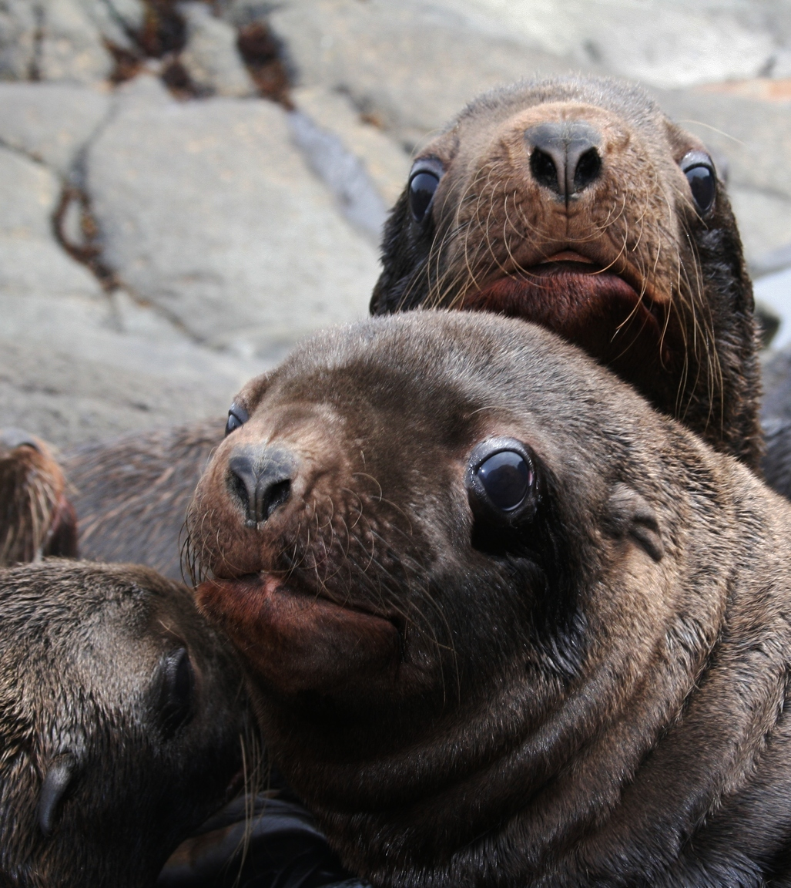
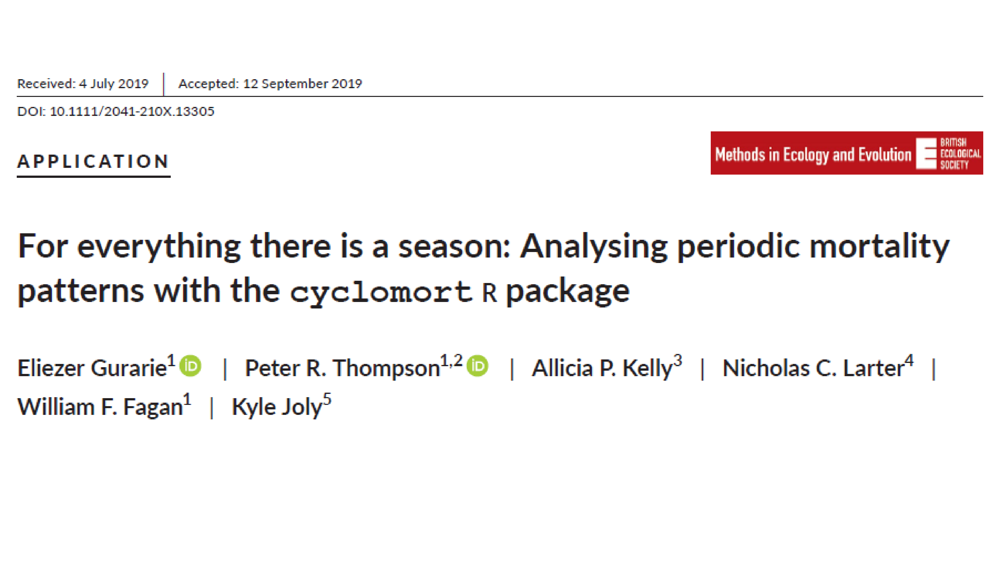

```{r setup, include=FALSE}
knitr::opts_chunk$set(echo = FALSE, message = FALSE, cache = TRUE, warning = FALSE, las = 1, dpi = 100)
#output: html_document
```


```{r colsFunction, eval = FALSE}
#system("cp ../mycss.css ./")
#system("cp images/LEGO_bg.jpg ./bg.jpg")
xaringan::inf_mr()
```


```{r cache = FALSE}
#require(elieslides)
pars <- function(...){
    par(mar = c(3,3,2,2), bty = "l", mgp = c(1.5,.25,0),
        tck = 0.01, cex.lab = 1.2, ...)
}
require(kableExtra)
```

# All models have these pieces:

$$\Huge Y = f({\bf X} | \bf{\Theta})$$
 - **Y** - response | dependent variable.  The thing we want to model / predict / understand. The **effect** (maybe). 
 
- **X** - predictor(s) | independent variable(s) | covariate(s).  The thing(s) that "explain(s)" **Y**. The **cause** (maybe). 

- **f** - the model structure.  This includes: some **deterministic functional form** form (*linear? periodic? polynomial? exponential?*) AND some **probabilistic assumptions**, i.e. a way to characterize the variability / randomness / unpredictability of the process. 

- $\bf \Theta$ - the parameters of the model.  There are usually some parameters associated with the **predictors**, and some associated with the **random bit**. 

---

# Goals (Art / Science)  of Modeling

$$\Huge Y = f({\bf X} | \bf{\Theta})$$

.pull-left[

### 1. Model fitting

.darkred[
What are the **best** $\bf \Theta$ values given $f, {\bf X}, Y$?
]

**Fitting the model** = **estimating the parameters**.  

Usually according to some criterion (almost always *Maximum Likelihood*.

]

--

.pull-right[
### 2. Model selection

.darkred[

What are the **best** of a set of models $f_1$, $f_2$, $f_3$ given $\bf X$ and $Y$?

]

Different models *usually* vary by what particular variables go into **X**, but can also vary by **functional form** and **distribution assumptions**

Use some **Criterion** (e.g. AIC) to "select" the best model, which balances **how many parameters you estimated**  verses **how good the fit is**. 

]


---

# What are "likelihoods"?

.pull-left[

### Oakie

 

]

.pull-right[

### Orange

 

]

.red.center.large[**Q:** What is the "best model" for squirrel morph distribution?]

---

## Data and Models 

.pull-left[

### Data / observations: $X_{ij}$

| island | a. Orange | b. Oakie|
|---|---|---|
| squirrel 1: | $X_{a,1}$ = 1 | $X_{b,1}$ = 1 |
| squirrel 2: | $X_{a,2}$ = 1 | $X_{b,2}$ = 0 |


- 1 = light morph
- 0 = dark morph
]


.pull-right[

### Models 

| | model | k|
|---|:--|:---|
| M1: | $P(X_{ij} = 1) = p = 0.5$ | 1
| M2: | $p = 0.75$ | 1
| M3: | $p_a = 1$; $p_b = .5$ | 2
| M4: | $p_{a,1} = 1;\,\,\, p_{b,1} = 1 \\ p_{a,2} = 1;\,\,\, p_{b,2} = 0$ | 4


**very important to keep track of the number of parameters!**
]

---


## Likelihoood (of a model)

.large[
**Product** of **probabilities** of **data** given **model**.

$$\Large {\cal L}(model) = \prod_{i = 1}^n \text{Pr}(X | model)$$

- We **never** care about the **absolute** value of the likelihood! 
- Only the *relative* value of the likelihood. 
]

---

## Four different Squirrel Models:


Data: $$X_{a1} = 1;\, X_{a2} = 1; X_{b1} = 1;\, X_{b2} = 0$$

| model | | likelihood | |
|---|---|---|---|
| M1 | $p = 0.5$ | ${1\over2} \times {1\over2} \times {1\over2} \times {1\over2}$ | 0.0625 |
| M2 | $p = 0.75$ | ${3\over4} \times {3\over4} \times {3\over4} \times {1\over4}$ | 0.1055 |
| M3 | $p_a = .5$; $p_b = 1$ | $1\times1\times{1\over2}\times{1\over2}$ | 0.25 |
| M4 | $p_{a,1} = 1;\, p_{b,1} = 1; \, p_{a,2} = 1;\, p_{b,2} = 0$ | $1\times1\times1\times1$ | 1 |


$$\cal{L}(M4) > \cal{L}(M3) > \cal{L}(M2) > \cal{L}(M1)$$

.center[*M4** has the higest likelihood!  But is this a useful model?]

---

## A(kaike) Information Criterion

A good fit is great!  But it is useless if it uses too much information (too many parameters).  This is *overfitting*.  **One parameter per data point is TOO MANY parameters!**

.pull-left[

Hirotugo Akaike 赤池 弘次 (1927-2006)
]

.pull-right[

Simple formula: 

$$AIC = -2 \log({\cal L})+ 2k$$

(where $k$ is the number of parameters)

- Better fit = higher $\cal L$ = lower AIC.  
- Too complicated = more k = higher AIC. 

**Lowest AIC is "best" model**
]

---

## Compute AIC 

| model | likelihood | log-likelihood | k | AIC
|---|---|---|---|---|
| **M1:** coin flip |  0.0625 | -2.77 | 1 | 7.55
| **M2:** proportional odds| 0.1055  | -2.25 | 1 | **6.50**
| **M3:** island specific| 0.25    | -1.39 | 2 | 6.77
| **M4:** individual specific| 1       | 0     | 4 | 8


.center[AIC2 < AIC3 < AIC1 < AIC4

.large[Most *parsimonious* model is M2!]

**Conclusion:** not enough evidence to identify a difference between islands.   
]

---

## Let's add one more observation ...
.pull-left[

### Oakie Island 


]

.pull-right[

### Orange Island

]


$$X_{b,3} = dark$$

---


## Updated squirrel models:

 model | probs | Likelihood |  | k |  AIC|
---|---|---|---|---|---|
 M1 | $p = {1\over2}$ | ${1\over2} \times {1\over2} \times {1\over2} \times {1\over2} \times {1\over2}$ | = 0.03125 | 1 | 8.93
 M2 | $p = {3\over 4}$ | ${3\over4} \times {3\over4} \times {3\over4} \times {1\over4} \times {1\over4}$ | = 0.02637 | 1 | 9.27
 M2b | $p = {3\over 5}$ | ${3\over5} \times {3\over5} \times {3\over5} \times {2\over5} \times {2\over5}$ | = 0.0346 | 1 | 8.73
 M3 | $p_a = .5; p_b = 1$ | $1\times1\times{1\over2}\times{1\over2}\times0$ | = 0 (!!) | 2 | $\infty$
 M3b | $p_a = {1\over2}; p_b = {2\over3}$ | ${1\over2} \times {1\over2} \times {2\over3} \times {2\over3} \times {1\over3}$ | = 0.037 | 2 | 10.6

```{r, eval = FALSE}
X <- c(1,0,1,1,0)
p1 <- .5
p2 <- 3/4
p2b <- 3/5
p3b <- c(rep(1/2,2), rep(2/3,3))

Ps <- list(
    P1 = ifelse(X, p1, 1- p1),
    P2 = ifelse(X, p2, 1- p2),
    P2b = ifelse(X, p3, 1- p2b),
    P3 = 0,
    P3b = ifelse(X, p3b, 1 - p3b))

L = sapply(Ps, prod)
k <- c(1,1,1,2,2)
data.frame(L, k, AIC = -2*log(L) + 2*k)
```

---

## Updated (1 parameter) squirrel models:

.pull-left[
 model | probs | | ${\cal L}$ 
---|---|---|---|
 M1 | $p = {1\over2}$ | ${1\over2} \times {1\over2} \times {1\over2} \times {1\over2} \times {1\over2}$ | 0.03125 
 M2 | $p = {3\over 4}$ | ${3\over4} \times {3\over4} \times {3\over4} \times {1\over4} \times {1\over4}$ | 0.02637 
 M2b | $p = {3\over 5}$ | ${3\over5} \times {3\over5} \times {3\over5} \times {2\over5} \times {2\over5}$ | 0.0346 
 
 

If you sweep through all possible values of $p$, you find that
$\widehat p = 3/5$ leads to the highest likelihood.  

This is the **maximum likelihood estimate** (MLE) of the probability that a squirrel is light morph.  

But you can also get (good) Confidence Intervals from looking at the curve of the profile. 

]

.pull-right[

### Likelihood profile

```{r, eval = TRUE, fig.width = 5, fig.height = 3}
par(bty = "l", tck = 0.02, mgp = c(1.1,.25,0), cex.lab = 1.1, mar = c(3,3,1,1))
ps <- seq(0,1, .01)
X <- c(1,0,1,1,0)
getL <- function(p, X) prod(ifelse(X, p, 1- p))

plot(ps, sapply(ps, getL, X), type = "l", ylab = "Likelihood", xlab = "probability estimate")
abline(v = c(1/2, 3/5, 3/4), col = 2:4, lwd = c(1,2,1))
points(c(1/2, 3/5, 3/4), sapply(c(1/2, 3/5, 3/4), getL, X), pch = 19, cex = c(1,2,1), col = 2:4)
```
]

---
.pull-left-70[

# Null (linear) model


```{r, fig.width = 5, fig.height = 3}
pars()
pcks <- c("magrittr","plyr","ggthemes","ggplot2")
a <- sapply(pcks, require, character = TRUE)
pups <- read.csv("data/SeaLions.csv") 
#head(pups_raykoke)
hist(pups$Weight)
```

```{r echo = TRUE}
mean(pups$Weight)
sd(pups$Weight)
```
]

.pull-right-30[




This suggests a model!  

$$W \sim {\cal N}(\mu = 33\,kg, \sigma = 5.7)$$
With no covariates. 

]

---
.pull-left-70[

# Simple linear model

*Probably* there is a relationship between length and weight.  The simplest relationship is linear. 


$$\large Y \sim {{\cal N}(\text{mean} = \beta_0 + \beta_1 X,\,\, \text{sd} = \sigma)}$$

```{r, fig.width = 5, fig.height = 3, dpi = 200}
pcks <- c("magrittr","plyr","ggthemes","ggplot2")
a <- sapply(pcks, require, character = TRUE)
pups_raykoke <- read.csv("data/SeaLions.csv") %>% subset(Island == "Raykoke")
ggplot(pups_raykoke, aes(Length, Weight)) + 
    geom_point(col = alpha("black", .5)) + 
    geom_smooth(method = "lm") + 
    #facet_wrap(.~Sex) + 
    theme_few() + ggtitle("Steller sea lion size")
```
]


.pull-right-30[


Steller sea lion (*Eumatopias jubatus*) pups.  
]

---

.pull-left[
## Deterministic model:

$$Y_i = \beta_0 + \beta_1 X_i$$

- $\beta_0$ - intercept
- $\beta_1$ - slope

This is the **functional form of the predictor**
]

.pull-right[
## Statistical model:

**Version 1:**

$$Y_i = \beta_0 + \beta_1 X_i + \epsilon_i$$
where $\epsilon_i \sim {\cal N}(0, \sigma)$


or

**Version 2:**

$$Y_i \sim {\cal N}(\beta_0 + \beta_1 X_i, \sigma)$$
]

V2 is better because it is more transparent about the number of parameters!  

- Two (intercept | slope) are part of the **functional form** 
- One (residual standard deviation) is part of the **random component**. 

---

## But other variables might influence pup size
```{r}
pups <- read.csv("data/SeaLions.csv") %>% mutate(Sex = ifelse(Sex == "F", "Female", "Male"))
```

```{r}
p.sex <- ggplot(pups, aes(Sex, Weight)) + 
    geom_boxplot() + stat_smooth(method = "lm") + 
    theme_few() + 
    ggtitle("Pup weight against sex") 

p.island <- ggplot(pups, aes(Island, Weight)) + 
    geom_boxplot() + stat_smooth(method = "lm") + 
    theme_few() + 
    ggtitle("Pup weight against island ") 

p.sexlength <- ggplot(pups, aes(Length, Weight, factor = Sex, col= Sex)) + 
    geom_point() + stat_smooth(method = "lm") + 
    theme_few() + 
    guides(fill=guide_legend(ncol=2)) + 
    ggtitle("Pup weight against sex and length") 

p.sexislandlength <- ggplot(pups, 
                      aes(Length, Weight, factor = Sex, col= Sex)) + 
    geom_point() + stat_smooth(method = "lm") + 
    theme_few() + facet_wrap(.~Island)  + 
    ggtitle("Pup weight against sex and length and island") 
```

.pull-left-30[
Lots of competing models with different **main** and **interaction** effects. 
]

.pull-right-70[
```{r fig.width = 8, fig.height = 6}
require(gridExtra)
grid.arrange(p.sex, p.island, p.sexlength,  p.sexislandlength, 
             ncol = 2, widths = c(2,3), heights = c(2,3))
```
]

---

## Fitting and model selection


.pull-left-70[
```{r}
pup.formulae <- list(
  Weight ~ 1,
  Weight ~ Island,
  Weight ~ Sex,
  Weight ~ Length,
  Weight ~ Length + Sex,
  Weight ~ Length + Sex + Island,
  Weight ~ Length * Sex,
  Weight ~ Length * Sex + Island,
  Weight ~ Length * Sex * Island)
names(pup.formulae) <- as.character(pup.formulae)
fit.list <- lapply(pup.formulae, lm, data = pups)
buildAICtable <- function(fit){
  data.frame(k = length(fit$coef), 
             R2 = summary(fit)$r.squared %>% round(3),
             logLik = logLik(fit) %>% round(1),
             AIC = AIC(fit) %>% round(1))
}
dAIC.table <- pup.formulae %>% 
  lapply(lm, data = pups) %>% ldply(buildAICtable) %>%      
  mutate(dAIC = AIC - min(AIC)) %>% 
  plyr::rename(c(.id = "Model")) %>% # rename .id column
  arrange(dAIC) # arrange by dAIC
require(kableExtra)
kable(dAIC.table) %>% kable_styling() %>% 
  row_spec(1, bold = TRUE, background = "yellow")
```
]

.pull-right-30[

This is what we expect ... the interaction between **sex** and **length** is consistent across islands, but there are some main effect differences across islands (mainly because of the time we sampled). 
]
---

## Model selection vs. parameter estimates

The best model: 

$$Y_{ijk} = \beta_0 + \beta_{1i} \text{Island}_{ijk} + (\beta_2 + \beta_{3j} \text{Sex}_{ijk})\times(\text{Length}_{ijk})  + \epsilon_{ijk}$$

.pull-left[

What are the **parameter estimates** (effect sizes) of the selected model? 

.small[
```{r results = "asis"}
library(dplyr)
lm(Weight ~ Sex*Length + Island - 1, data = pups) %>% tidy %>%
  mutate_if(is.numeric, round, 2) %>% kable
```

]]

.pull-right[
```{r fig.width = 6, fig.height = 5}
fitLengthSex <- function(df) lm(Weight ~ Length * Sex, data = df)
island_fits <- dlply(pups, "Island", fitLengthSex)
require(broom)
island.results <- ldply(island_fits, tidy)
ggplot(island.results %>% 
         mutate(low = estimate - 2*std.error, high = estimate + 2*std.error) %>%
         subset(term != "(Intercept)"), 
       aes(estimate, Island, col = p.value < 0.05 , xmin = low, xmax = high)) + geom_errorbarh() +
  geom_point() + geom_vline(xintercept = 0, col = "darkgrey", lty = 2) + 
  facet_wrap(.~term, scales = "free_x") + theme_few() + theme(legend.position = 'bottom')
```
]


---
class: small

.pull-left[
## *Generalized* linear model

### Normal Model

.large[$$Y_i \sim {\cal Normal}(\alpha_0 + \beta_1 X_i, \sigma)$$]
Models continuous data with a "normal-like" distribution.

```{r, fig.height = 3, fig.width = 5}
pars()
set.seed(1976)
X <- 0:15
a <- 1; b <- 1/2
sigma <- 1
plot(X, a + b*X + rnorm(length(X), 0, sigma), 
     pch = 19, ylab = "Y", ylim = c(-1,11), 
     main = expression(alpha == 1~";"~beta == 1/2~";"~sigma == 1),
     xlab = "covariate (X)")
abline(a,b, col = "red", lwd = 2)
```
]

--

.pull-right[
### Binomial model

.large[$$Y_i \sim {\cal Bernoulli}\left( \frac{\exp(\alpha + \beta X_i)}{1 + \exp(\alpha + \beta X_i)} \right)$$]

There's some *probability* of something happening that depends on the predictor $X$.  

**Bernoulli** just means the data are all 0 or 1. 

```{r, fig.height = 3, fig.width = 5}
expit <- function(x) exp(x)/(1+exp(x))

pars()
curve(expit(1/2*x - 3), xlim = c(0,15), lwd = 2, ylim = c(0,1), 
      ylab = "probability", xlab = "covariate (X)", 
      main = expression(alpha==-3~';'~beta==1/2))
```

This models **presence/absence**, **dead/alive**, **male/female** other response variables with **2** possible outcomes. 
]


---
background-image: url('images/SoleaSolea.png')
background-size: cover

### What factors predict occurence of *Solea solea* larvae?

Sampled in the estuary of the Tejo river in Portugal

- Lots of environmental factors in data

.pull-right-70[.footnotesize[
```{r, results = "asis"}
solea <- read.csv("data/Solea.csv") %>% 
    mutate(presence = Solea_solea)
s <- solea %>% mutate(Solea_solea = NULL) %>% head
s[1:6, 5:13] %>% kable %>% kable_styling %>% column_spec(9, bold=TRUE)
```
]]

---

# Presence of *Solea solea* against **salinity**

.pull-left-40[
```{r, eval = TRUE, echo = FALSE, fig.height = 4, fig.width = 4}
ggplot(solea %>% mutate(presence = Solea_solea == 1), 
       aes(presence, salinity, col = presence)) + 
    geom_boxplot() + geom_jitter() + xlab("") + 
    ggtitle("Presence of Solea vs. salinity") + coord_flip() + 
    theme(legend.position = "none")
```
]

.pull-right-60[

Modeling is EXACTLY the same as **linear regression** except:
- `glm` - for **generalized** linear model (instead of `lm`)
- `family = 'binomial'` is the instruction to fit the logistic regression

```{r, echo = FALSE, eval = FALSE}
glm(presence ~ salinity, data = solea, family ='binomial')
```
`glm(presence ~ salinity, family ='binomial')`

<font size = 4>
```{r, eval = TRUE, echo = FALSE}
summary(glm(presence ~ salinity, data = solea, family ='binomial'))$coef %>% apply(2, round, 3) %>% kable
```
</font> 

Clearly - *Solea solea* presence is very significantly *negatively* related to salinity.  
]


---
### Out of this model we can make predictions


```{r, fig.width = 8, fig.height = 4.5, dpi = 100, out.width = "80%"}
par(bty = "l", cex.lab = 1.5, tck = 0.02, mgp = c(1.25,.25,0), mar = c(3,3,1,1), las = 2)
plotBinary <- function (X, Y, ...) 
 {
     plot(X, jitter(Y, factor = 0.1), col = rgb(0, 0, 0, 0.5), 
         pch = 19, ylim = c(-0.2, 1.2), ...)
     boxplot(X ~ Y, horizontal = TRUE, notch = TRUE, add = TRUE, 
         at = c(-0.1, 1.1), width = c(0.1, 0.1), col = "grey", 
         boxwex = 0.1, yaxt = "n")
}
expit <- function(x) exp(x)/(1 + exp(x))
Sole.glm <- glm(presence ~ salinity, family=binomial(link="logit"), data = solea)
Sole.predict <- predict(Sole.glm, 
                        newdata = data.frame(salinity = 0:40), 
                        se.fit = TRUE) %>% data.frame %>% 
    mutate(phat = expit(fit), low= expit(fit - 2*se.fit), high = expit(fit + 2*se.fit))

### The basic plot, and the prediction
plotBinary(solea$salinity, solea$Solea, xlab = "Salinity", ylab = "Presence", yaxt = "n")
lines(0:40, expit(Sole.predict$fit))
with(Sole.predict,{
    polygon(c(0:40,40:0), 
            c(low, high[41:1]), col=alpha("orange", .5), bor = NA)
    lines(0:40, phat, lwd = 2, col = "darkred")

})
axis(side = 2, at = c(0,1))
```

---

.pull-left[

## $\Delta$AIC analysis - and coefficients

```{r, echo = FALSE}
formulae <- list(
    M1 = presence ~ depth,
    M =  presence ~ temp,
    M1 = presence ~ salinity,
    M1 = presence ~ gravel,
    M2 = presence ~ depth + temp,
    M3 = presence ~ depth + salinity,
    M4 = presence ~ depth + gravel,
    M5 = presence ~ temp + salinity,
    M6 = presence ~ temp + gravel, 
    M6 = presence ~ salinity + gravel, 
    M6 = presence ~ depth + temp + gravel,
    M6 = presence ~ depth + temp + salinity)

names(formulae) <- paste0("M", 1:length(formulae)-1)
fits <- llply(formulae, function(l) glm(l, data = solea, family = "binomial"))

AICtable <- ldply(fits, function(f){
    f.char <- as.character(formula(f))
    f.char2 <- paste(f.char[3:length(f.char)], collapse = " + ")
    data.frame(Model = f.char2, 
               k =  summary(f)$coef %>% nrow, 
               logLik = logLik(f)  %>% round(1),
               AIC = AIC(f)  %>% round(1))
    }) %>% mutate(dAIC = AIC - min(AIC)) %>% plyr::rename(c(.id = "")) %>% plyr::arrange(AIC)
```

```{r, results = "asis"}
AICtable %>% kable %>% 
    row_spec(which(AICtable$dAIC < 2), bold = T, color = "darkblue", background = "lightgreen") %>% 
    row_spec(which(AICtable$dAIC == 0), bold = T, color = "darkblue", background = "yellow")
```
]

.pull-right[
**Salinity** clearly among the more important covariates (in the top 4 models). 

```{r, echo = FALSE, eval = TRUE, fig.height = 4, fig.width = 4, dpi = 200}
pars()
#f <-  glm(presence ~ depth * salinity + temp + gravel, 
#          data = solea, family = "binomial")
#d <- MuMIn::dredge(f)
#head(d, 10)

require(broom); require(GGally)
f <-  glm(presence ~ gravel + salinity + depth + temp, 
          data = solea, family = "binomial")
df <- tidy(f, conf.int = TRUE)[-1,] %>% 
    mutate(sign = ifelse(conf.high < 0, "negative",
                         ifelse(conf.low > 0, "positive", 
                                "non-significant")))
ggplot(df, aes(estimate, term, 
               xmin = conf.low, xmax = conf.high,
               color = sign)) + 
    ggtitle("coefficients") + 
    geom_vline(xintercept = 0, col = "grey", lwd = 2) + 
    geom_linerange(lwd = 1.5, alpha = 0.6) + 
    geom_point(size = 5) + theme_classic() + 
    theme(legend.position = c(0.8, 0.9))
```

]

---

## .darkred[**Take-aways on (linear) modeling**]

`1.` **Statistical modeling** separates **patterns** (the model) from "**randomness**" (unexplained variation).

--

`2.` We structure our models to have a **response variable** and one or more **predictors** or **covariates**. 

--

`3.` Depending on the response variable, a different **family** is chosen:

.pull-left[
- if **continuous** and symmatric: **Normal**
- if 1/0 (presence/absence, dead/alive): **Binomial** 
]
.pull-right[
- if counts: **Poisson**
- if lots of zeros: **zero-inflated** or **hurdle**
]

--

`4.` An important task is **Model selection**, identifying which model is "best" 
  - Best means *"explains the most variation without overfitting"* 
  - Very common criterion is **AIC.**
  - lots of **back and forth** between **fitting** and **selection**

--

`5.` Once a model is "selected", we can:
  - analyze the results by seeing the **effect sizes** (magnitude of coefficients, aka *slopes*) and **directions** (signs of coefficients) 
  - make **inferential predictions** by "spreading" our model over a larger landscape.

--
  
`6.` **Well over 90% of wildlife modeling (esp. habitat) is done along these lines!**


---

# Funkier (non-linear) - but relevant model



---


---

background-image: url("images/mortality/cyclomort_15.png")
background-size: cover

---

background-image: url("images/mortality/cyclomort_24.png")
background-size: cover

---

background-image: url("images/mortality/bg.png")
background-size: cover

# Take home message
.pull-left-50[
- Not all models have to be linear!  You can get creative and try to capture a process of actual biological interest.  

- As long as you can **write the model** (i.e. the likelihood function), you can *probably* **fit the model**, and just remember to **keep track of the number of parameters**!
]