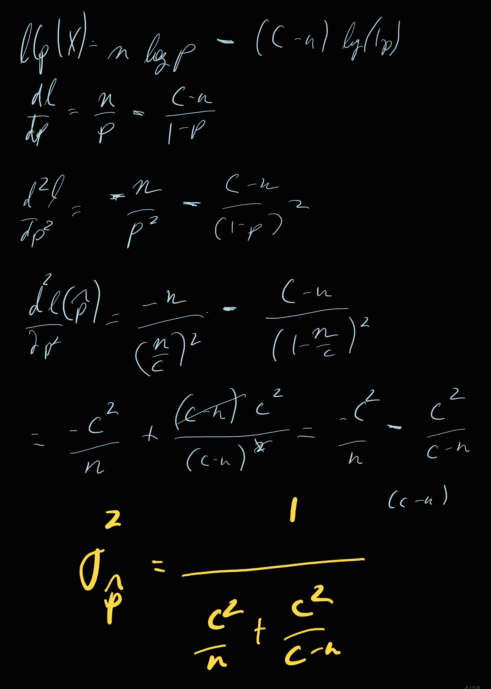

```{r setup, include=FALSE}
knitr::opts_chunk$set(echo = TRUE, message = FALSE, warning = FALSE)
```
```{r, echo = FALSE}
eliepars <- function()
    par(bty = "l", tck = 0.01, mar = c(3,3,2,2), las = 1, 
        cex.axis = 0.8, cex.lab = 1.1, mgp = c(1.5,.25,0))
```

Survival analysis models time-to-event as an outcome (e.g. time to death, how long do you wait for an animal to appear in a camera trap, when will an earthquake strike, when will a mango fall, etc).  There are, in short, lots of ecological applications.  But the biggest by far is, in fact, modeling survival.  

The goals in this lecture are to get an intuition for why time-to-event data is fundamentally different than other kinds of observations, and - on the basis of a simple experiment - get intuition for the *hazard function* and *censored data* and how to estimate those using maximum likelihood.  

# Discrete Hazard process

We rolled dice - 52 to be precise - each until we got a 6. 
Each roll represented a year.  Once a **6** was rolled, the die was dead and removed.  Like with these


Here are the data:

```{r, echo = -1}
eliepars()
X <- read.csv("survival.csv")[,1]
mean(X)
plot(table(X), type = "h")
```

If you like, you can also simulate this process:

```{r, echo = -1, eval = FALSE}
set.seed(1976)
X <- rep(NA, 50)
for(i in 1:length(X)){
    rolls <- 0
    x <- 0
    while(x != 6){
        rolls <- rolls+1
        x <- sample(1:6,1)
    }
    X[i] <- rolls
}
```


## Probability distribution

The probability mass function of mortality time is:

$$Pr(X = x) = f(x|p) = p(1-p)^{x-1}$$

This can be reasoned out, but also has a name, the [negative binomial distribution](https://en.wikipedia.org/wiki/Negative_binomial_distribution): $X \sim \text{NegBinom}(p)$[^1].

[^1]: *Important note:* the standard definition of the negative binomial is *number of failures before first success*, so it includes 0, whereas in our definition if the event dies in the first attempt, that's a 1, not a 0, so technically:  $X+1 \sim \text{NegBinom}(p)$.  This becomes important later. 

## Likelihood function

$${\cal L}(p|{\bf X}) = \prod_{i=1}^n f(X_i|p)$$

log-likelihood:

$$\begin{align} {\cal l}(p|{\bf X}) &= \sum (X_i-1) \log(1-p) + n\log(p) \\
& = n\log(p) + \left(\sum X_i - n\right) \log(1-p) \end{align}$$

```{r, echo = -1}
eliepars()
p.ll <- function(p, X){
  n <- length(X)
  n*log(p) + (sum(X)-n) * log(1-p)
}
curve(p.ll(x, X = X), xlab = "p", ylab = "log-likelihood")
```

## Maximum likelihood estimate

The maximum likelihood estimate is where this curve is - at a maximum!  

```{r}
(p.hat <- optimize(p.ll, c(0,1), X = X, maximum = TRUE))
```

Plot the maximum

```{r}, echo = -1}
eliepars()
curve(p.ll(x, X = X), xlab = "p")
abline(v = p.hat, lwd = 2, col = 2)
```


But now we can also get a confidence interval, using the all important *Hessian*.  Recall that for a maximum likelihood estimate $\widehat{\theta}$ , an asymptotic estimate of its variance is given by $$\sigma^2_{\hat\theta} = {-1\over d^2l(\hat\theta)/d\theta^2}$$

i.e., the greater the (negative) curvature, the smaller the standard error.  Here's one way to compute this:

```{r}
require(Rdistance)
p.dd <- secondDeriv(p.hat$maximum, p.ll, X = X)
se = sqrt(-1/p.dd)
(CI  = p.hat$maximum + c(-2,2) * se[1,1])
```

`optim`, rather than `optimize`, does this all at once if you ask for the "Hessian".  Some notes about the somewhat fussy (but very important) `optim` function: 
- by default it *minimizes*, so to make it *maximize* you have to add the `control = list(fnscale = -1)` OR you can just make your function return the negative log-likelihood, 
- `method = "L-BFGS-B"` gives "box constraints" - limiting the search to a known range, but because the log-likelihood is infinity at 0 and 1, we have to 
- the `par` argument is an "initial guess" - the place where the optimizer will start looking for a maximum. 

```{r}
(p.fit <- optim(par = 0.5, p.ll, X = X, 
      control = list(fnscale = -1), 
      hessian = TRUE, method = "L-BFGS-B", 
      lower = 1e-7, upper = 1-1e-7))
```

There's a fair amount of output.  All we need is the estimate itself (`$par`) and the Hessian (`$hessian`)

```{r}
p.hat <- p.fit$par
p.se <- sqrt(-1/p.fit$hessian[1,1])
list(p.hat = p.hat, p.CI = p.hat + c(-2,2) * p.se)
```

Easy peasy!  

## Analytic solution

This is a rare likelihood that you can actually solve analytically - which is a satisfying problem to solve. To get the estimate you have to take the derivative of the log-likelihood against $p$ and set it to 0.  

$${dl \over dp} = {n \over p} - {\sum X_i - n \over 1-p}$$

Setting this equal to 0 and solving for $\widehat{p}$ gives the (intuitive):

$$\widehat{p} = {n \over \sum_i^n X_i}$$
*Can you think of another, even more compact way to write this!?*

Quick check

```{r}
list(p.hat_math = length(X)/sum(X), 
     p.hat_optim = p.hat)
```

The standard error of this estimate can also be calculated **analytically**!  That's an exercise for a lazy Sunday afternoon, or a train ride, or some other time.  

The solution is $\sigma = {n(C-n) \over C^2(C-n) + C^2n}$ where $C = \sum X_i$.  Check it out:

```{r}
n <- length(X)
C <- sum(X)
list(sigma_math = sqrt(n*(C-n)/(C^2 * (C-n) + C^2*n)), 
     sigma_optim = p.se)
```

Wow!


Here's the derivation for the interested:



# Discrete Hazard with Censoring

**Censoring** is a very important feature of survival data.  Basically, you can't follow your population forever, so at some point objects "fall out" of the study. You don't know when the event happened, just that is had to happen after we were done making observations.   

Here, we'll do something very simple: we'll simply say we can only follow our individuals for 6 years. Afterwards, we don't track them anymore. 

Let's generate more data (this time I just use the negative binomial shortcut, and manually censor):

```{r}
X <- read.csv("survival.csv")[,1]
X.full <- X
Y <- rep(6, sum(X > 6))
X <- X[X <= 6]
```

The `X's` are the  "known fate" data 

```{r}
sort(X)
```

and the `Y`'s now are censored .. all 6's:
```{r}
Y
```

Here's a nice visualization of these data:

```{r, echo = -1}
eliepars()
X.censored.df <- data.frame(X = c(sort(X),Y), 
                           censored = c(rep(FALSE, length(X)), 
                                        rep(TRUE, length(Y))))
n <- nrow(X.censored.df)
with(X.censored.df, {
     plot(X, 1:n, type = "n", 
          ylab = "", xlab = "time to event")
     segments(rep(0, n), 1:n, X, 1:n, 
              col = c("black", "darkgrey")[censored + 1])
    })

legend("bottomright", col = c("black", "darkgrey"), 
       legend = c("dead", "censored"), lty = 1)
```

Can we still estimate the hazard probability $p$?  

## Probability distribution

There are now 2 data streams.  The first, $X$, has the same distribution as before:
$$Pr(X = x) = f(x,p) = p(1-p)^{x-1}$$

The second $Y$ will have value $y$ as long as the actual event $X$ is greater than $y$, so:

$$g(y,p) = Pr(Y = y) = Pr(X > y) = \sum_{i = y+1}^\infty p(1-p)^{i-1}$$

This is not as tidy as the non-censored example!  

## Likelihood function

The likelihood function now asks what is $p$ given $\bf X$, which contains $n$ known fate observations, and $\bf Y$, which contains $m$ censored observations is:

$${\cal L}(p|{\bf X},{\bf Y}) = \prod_{i=1}^n f(X_i|p) \prod_{i=1}^m g(Y_i|p)$$

The log likelihood is:

$$\begin{align} {\cal l}(p|{\bf X},{\bf Y})  &= \log({\cal L} (p|{\bf X},{\bf Y})) \\
 &= \sum_{i=1}^n \log(f(X_i|p)) + \sum_{i=1}^m \log(f(Y_i|p)) \end{align}$$

Ok, that's kind of a cop out.  It's not so easy or necessary to write out, but we can code it up using negative binomial short cuts. Namely that $f(x,p)$ is (very close to) the negative binomial *probability mass function*, and $g(y,p)$ is one minus the negative binomial *cumulative mass function*.[^2]  

[^2]: THIS is where that differnece is important! 

```{r}
p.censored.ll <- function(p, Z, Y){
    # true observations are the probability function dnbinom
    log.Z <- dnbinom(Z-1, prob = p, size = 1, log = TRUE)   
    # censored observations are the 1 - the cumulative probability pnbinom 
    log.Y <- log(1-pnbinom(Y-1, prob = p, size = 1))
    # here, the log has to bo on the outside, can you see why?
    sum(log.Z) + sum(log.Y)
}
```

Note that in R, all distribution functions have a `log` option ... now you maybe understand why:

Let's compare the likelihood function for both the full $X$ dataset, and the censored version:

```{r, echo = -1}
eliepars(); par(mar = c(3,4,1,1), mgp = c(2.25,.25,0))
ps <- seq(1e-4,1-1e-4, length = 1000)
ll <- sapply(ps, p.censored.ll, X, Y = Y)
ll.full <- sapply(ps, p.ll, X.full)
plot(ps, ll, type = "l", ylab = "log-likelihood")
lines(ps, ll.full, col = 2)
legend("bottomleft", col = 1:2, legend = c("censored data", "full data"), lty = 1)
```

## Maximum likelihood estimate

Using `optimize` to get the point estimate:

```{r}
(p.hat <- optimize(p.censored.ll, c(0,1), 
                   Z = X, Y = Y, maximum = TRUE))
```

```{r}
p.dd <- secondDeriv(p.hat$maximum, p.censored.ll, Z = X, Y = Y)
se = sqrt(-1/p.dd)
(CI  = p.hat$maximum + c(-2,2) * se[1,1])
```

Using `optim` instead:

```{r}
p.fit <- optim(0.5, p.censored.ll, Z = X, Y = Y, 
      control = list(fnscale = -1), 
      hessian = TRUE, method = "L-BFGS-B", 
      lower = 1e-7, upper = 1-1e-7)

p.hat <- p.fit$par
(p.se <- sqrt(-1/p.fit$hessian[1,1]))
list(p.hat = p.hat, p.CI = p.hat + c(-2,2) * p.se)
```

This is a horrible confidence interval!  But it was also pretty brutal censoring.  Let's simulate a process and get a better feel for how things can go:

```{r}
set.seed(1976)
X <- rep(NA, 1000)
for(i in 1:length(X)){
    rolls <- 0
    x <- 0
    while(x != 6){
        rolls <- rolls+1
        x <- sample(1:6,1)
    }
    X[i] <- rolls
}
X.full <- X
Y <- rep(6, sum(X > 6))
X <- X[X <= 6]
```

And estimate the full dataset:

```{r}
p.fit <- optim(0.5, p.ll, X = X.full, 
      control = list(fnscale = -1), 
      hessian = TRUE, method = "L-BFGS-B", 
      lower = 1e-7, upper = 1-1e-7)
p.hat <- p.fit$par
p.se <- sqrt(-1/p.fit$hessian[1,1])
list(p.hat = p.hat, p.CI = p.hat + c(-2,2) * p.se)
```

The censored dataset:

```{r}
p.censored.ll <- function(p, Z, Y){
    log.Z <- dnbinom(Z-1, prob = p, size = 1, log = TRUE)   
    log.Y <- log(1-pnbinom(Y-1, prob = p, size = 1))
    sum(log.Z) + sum(log.Y)
}

p.fit <- optim(0.5, p.censored.ll, Z = X, Y = Y, 
      control = list(fnscale = -1),
      hessian = TRUE, method = "L-BFGS-B", 
      lower = 1e-7, upper = 1-1e-7)

p.hat <- p.fit$par
p.se <- sqrt(-1/p.fit$hessian[1,1])
list(p.hat = p.hat, p.CI = p.hat + c(-2,2) * p.se)
```

Only the observed dataset:

```{r}
p.fit <- optim(0.5, p.ll, X = X, 
      control = list(fnscale = -1),
      hessian = TRUE, method = "L-BFGS-B", 
      lower = 1e-7, upper = 1-1e-7)

p.hat <- p.fit$par
p.se <- sqrt(-1/p.fit$hessian[1,1])
list(p.hat = p.hat, p.CI = p.hat + c(-2,2) * p.se)
```

This is a huge overestimate, and shows the importance of taking the censored data into account!


# Next time ...

we discuss how to generalize these principles to **continuous time to event** modeling, which is much more common / practical. 
