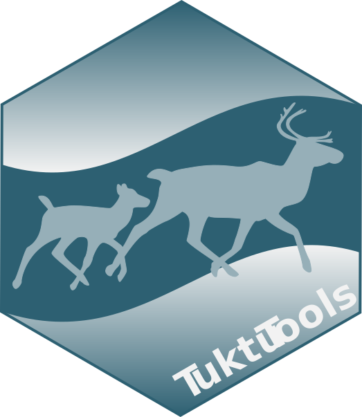
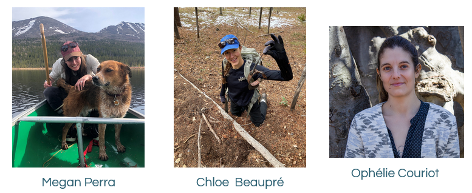

# Schedule of the day
.pull-left[
8:30 - TuktuTools 1

10:05 - coffee/tea/snacks

10:20 - TuktuTools 2

**12:00-1:30 - lunch break**

1:30 - Google Earth Engine 1

3:05 - coffee/tea/snacks

3:20 - Google Earth Engine 2

]
.pull-right[
.pull-left[]
.pull-right[]

]

---

# in the morning **TuktuTools**

.pull-left[
# TuktuTools

Collection of functions we've developed to facilitate exploration and analysis of movement data. We've started coding then in an R package called TuktuTools.  

Beyond TuktuTools details, our goal will be to practice coding & dealing with movement data in R.

]

.pull-right[]
---

# in the morning **TuktuTools**

.pull-left[
1. Basics of movement

2. Maps, means, ranges

3. Weather covariates

4. Estimating parturition

5. (time allowing) Hierarchical migration
]

.pull-right[]

---
# meet the team

